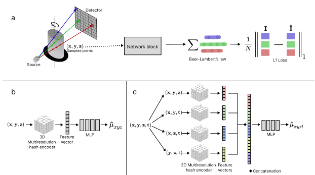

# NeCT: Neural Computed Tomography
NeCT is a project that aims to use deep learning to improve the quality of computed tomography (CT) images. NeCT allows for both static and dynamic CT reconstruction, and the project is based on the INR framework `tiny-cuda-nn`.
- [Installation](#installation)
- [Demo](#demo)
- [GUI](#gui)
- [Licensing and Citation](#licensing-and-citation)



## Installation
The project has been tested to work on both Windows and Linux with the following dependencies
<!-- make a table with name and version -->
<table>
<tr><th>Package</th><th>Version</th></tr>
<tr><td>python</td><td>3.11 | 3.12</td><td></td></tr>
<tr><td>pytorch</td><td>2.5</td><td></td></tr>
<tr><td> CUDA</td><td>12.1 | 12.4</td><td></td></tr>
<tr><td> CMake (For Linux)</td><td>3.24</td><td>For tiny-cuda-nn</td></tr>
<tr><td> C++17 (For Windows)</td><td></td><td>For tiny-cuda-nn</td></tr>
</table>

We recommend using [conda](https://docs.anaconda.com/free/anaconda/install/) or [uv](https://docs.astral.sh/uv/getting-started/installation/) to manage the python environment. For video export, the `avc1`-codec for `ffmpeg` is only available when using conda, so for `uv` video export will use `mp4v`-codec. If video export is vital, we recommend using conda.
The project has been tested for `python=3.11,3.12` and `pytorch=2.5`, but we assume it will work with newer versions as well. To install the project for multiple different compute capabilities, follow the instructions [here](#install-multiple-compute-capabilities).

Make sure that both `PATH` and `LD_LIBRARY_PATH` includes the paths to the CUDA binaries as described in [tiny-cuda-nn](https://github.com/NVlabs/tiny-cuda-nn/) before installing. If you experience some error when installing related to `tiny-cuda-nn`, please go to [issues of tiny-cuda-nn](https://github.com/NVlabs/tiny-cuda-nn/issues) and search to try to solve the problem. As binaries will be built for both tiny-cuda-nn and NeCT, the installation will usually take at least several minutes. 

#### Conda
Then create a conda environment and install all the dependencies. 

```bash
conda create -n nect python=3.12 -y
conda activate nect
conda install pytorch==2.5.1 torchvision==0.20.1 pytorch-cuda=12.4 lightning==2.1 conda-forge::opencv -c pytorch -c nvidia -c conda-forge -y
pip install -v git+https://github.com/haakonnese/nect
pip install git+https://github.com/NVlabs/tiny-cuda-nn/#subdirectory=bindings/torch
```

#### Uv
Then create a uv environment and install all the dependencies. 

```bash
uv venv --python=3.12
source venv/bin/activate
uv pip install git+https://github.com/haakonnese/nect
uv pip install git+https://github.com/NVlabs/tiny-cuda-nn/#subdirectory=bindings/torch --no-build-isolation
```


### Install multiple compute capabilities
To install the project for multiple different compute capabilities, follow the instructions below. The following environment variables needs to be set before installing NeCT if you want to build the binaries for multiple compute capabilities. In the example below, we install for compute capabilities 60 (P100), 70 (V100), 80 (A100) and 90 (H100).  
```bash
export CUDA_ARCHITECTURES="60;70;80;90"
export CMAKE_CUDA_ARCHITECTURES=${CUDA_ARCHITECTURES}
export TCNN_CUDA_ARCHITECTURES=${CUDA_ARCHITECTURES}
export TORCH_CUDA_ARCH_LIST="6.0 7.0 8.0 9.0"
export FORCE_CUDA="1"
```
## Data
Data is available at [OSF](https://osf.io/2w8xc/files/osfstorage). For automatically downloading the demo-data, check out the demo-folder.

### Installing TIGRE for projection synthesis (optional)
```bash
pip install Cmake
pip install git+https://github.com/CERN/TIGRE/#subdirectory=Python
```

## Demo
Demo scripts can be found under [demo](./demo/). First time reconstructing the demo-objects, projection-data will be downloaded.

## GUI
The GUI is a tool for visualizing the reconstructed 4D reconstruction (works only for 4D now). The GUI is based on the `PyQt5` library. The GUI can be started by running the following command:
```bash
python -m nect.gui
```

## Licensing and Citation
The project is licensed under the MIT license. 
The project is a collaboration between the Norwegian Univeristy of Science and Technology (NTNU) and the CT lab at Equinor.
If you use NeCT in your research, please cite the following paper: To be added.
